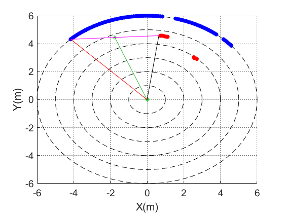

# FollowGapMethod 
## Author: Volkan Sezer, Metin Gokasan
[Paper: A novel obstacle avoidance algorithm: Follow the Gap Method][https://www.sciencedirect.com/science/article/pii/S0921889012000838]
- - -
### C++ 11 Environment
### This algorithm was experimented in simulation and realworld (using 2D Lidar)
</img>
### for example(main.cpp) 
<pre><code>
#include "FollowGap.h"
FollowGapMethod followGap 
result = followGap.Solve(yaw, DesiredYaw(from Vehicle Position to Goal Position),
Distance array(2D lidar data), minimum angle(lidar coordinates), maximum angle(lidar coordinates))

double finalX=followGap.finalDistance/1000.0*cosf(followGap.returnAngle*M_PI/180.0);
double finalY=followGap.finalDistance/1000.0*sinf(followGap.returnAngle*M_PI/180.0);
double obs1X=followGap.finalDist1*cosf(followGap.finalPI1*M_PI/180.0);
double obs1Y=followGap.finalDist1*sinf(followGap.finalPI1*M_PI/180.0);
double obs2X=followGap.finalDist2*cosf(followGap.finalPI2*M_PI/180.0);
double obs2Y=followGap.finalDist2*sinf(followGap.finalPI2*M_PI/180.0);

//ex result=followGap.Solve(yaw,desiredYaw,inputRanges,40,140); my horizontal of view is 100.
//if(result) control
</code></pre>
